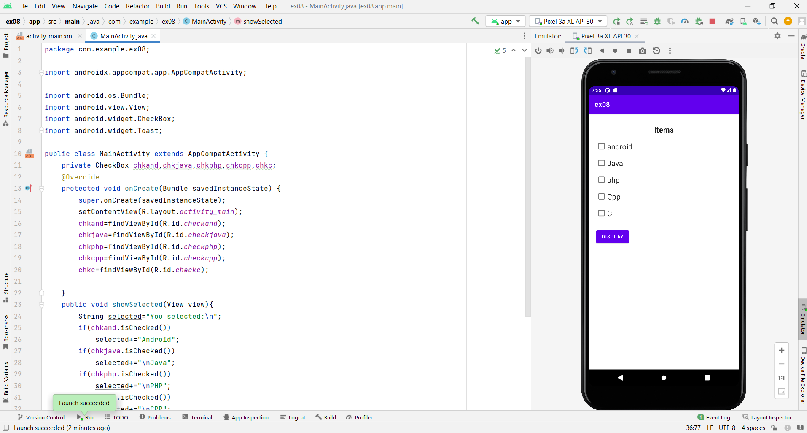
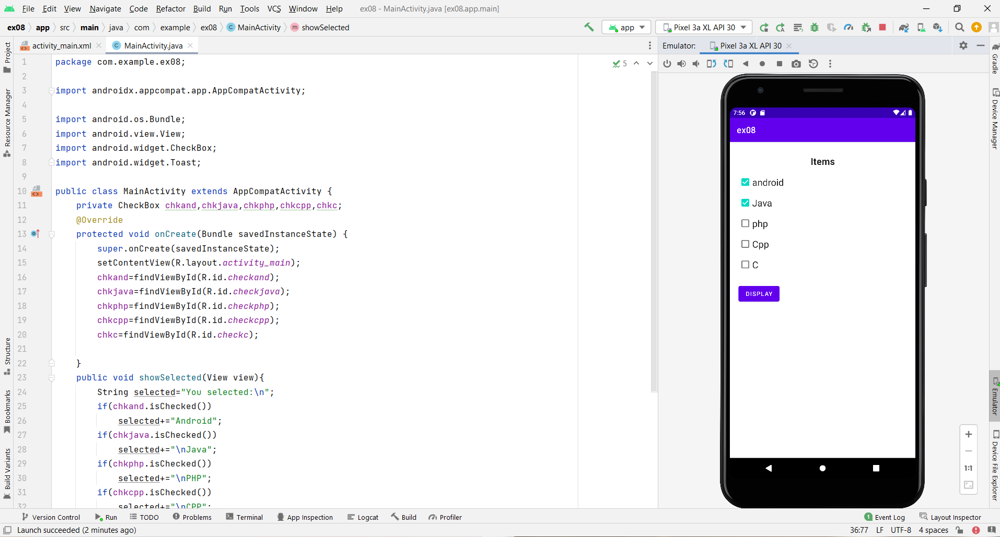
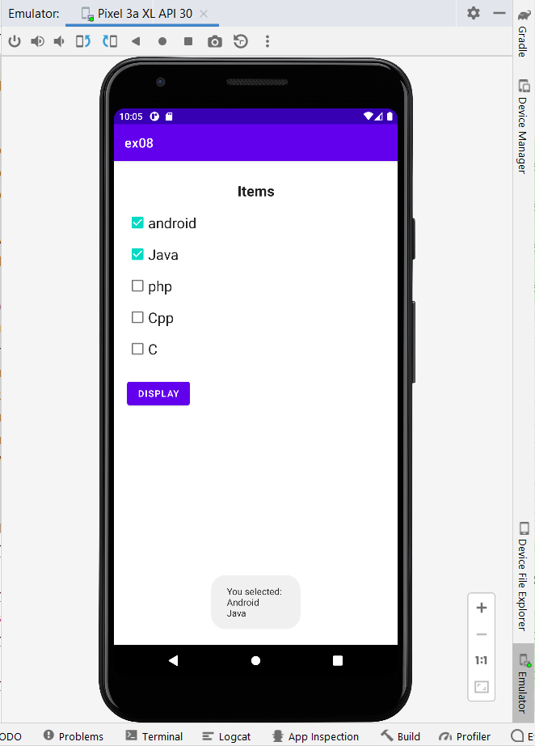

Exp: 08

Date: 04.11.2022

# Ex.No:8 Build a program to show five checkboxes and toast selected checkboxes.


## AIM:

To create a list using checkbox to display selected checkbox item using Android Studio.

## EQUIPMENTS REQUIRED:

Android Studio(Min.required Artic Fox)

## ALGORITHM:
Step 1: Open Android Studio and then click on File -> New -> New project.

Step 2: Then type the Application name as "listofitemselect" and click Next.

Step 3: Then select the Minimum SDK as shown below and click Next.

Step 4: Then select the Empty Activity and click Next. Finally click Finish.

Step 5: Design layout using UI components in activity_main.xml.

Step 6: Display the list using checkbox in MainActivity file.

Step 7: Save and run the application.


## PROGRAM:
```
/*
Program to display check list item”.
Developed by: Kaushika.A
Registeration Number : 212221230048
*/
```
## activity_main.xml:
```xml
<?xml version="1.0" encoding="utf-8"?>
<LinearLayout xmlns:android="http://schemas.android.com/apk/res/android"
    xmlns:app="http://schemas.android.com/apk/res-auto"
    xmlns:tools="http://schemas.android.com/tools"
    android:layout_width="match_parent"
    android:layout_height="match_parent"
    android:orientation="vertical"
    tools:context=".MainActivity"
    android:padding="20dp">

    <TextView
        android:id="@+id/textView"
        android:layout_width="match_parent"
        android:layout_height="wrap_content"
        android:gravity="center"
        android:layout_margin="10dp"
        style="@style/TextAppearance.AppCompat.Large"
        android:textStyle="bold"
        android:text="Items" />

    <CheckBox
        android:id="@+id/checkand"
        android:layout_width="wrap_content"
        android:layout_height="wrap_content"
       style="@style/TextAppearance.AppCompat.Large"
        android:text="android" />

    <CheckBox
        android:id="@+id/checkjava"
        android:layout_width="wrap_content"
        android:layout_height="wrap_content"
        style="@style/TextAppearance.AppCompat.Large"
        android:text="Java" />

    <CheckBox
        android:id="@+id/checkphp"
        android:layout_width="wrap_content"
        android:layout_height="wrap_content"
        style="@style/TextAppearance.AppCompat.Large"
        android:text="php" />

    <CheckBox
        android:id="@+id/checkcpp"
        android:layout_width="match_parent"
        android:layout_height="wrap_content"
        style="@style/TextAppearance.AppCompat.Large"
        android:text="Cpp" />

    <CheckBox
        android:id="@+id/checkc"
        android:layout_width="match_parent"
        android:layout_height="wrap_content"
        style="@style/TextAppearance.AppCompat.Large"
        android:text="C" />

    <Button
        android:id="@+id/buttondis"
        android:layout_width="wrap_content"
        android:layout_height="wrap_content"
        android:layout_marginTop="20dp"
        android:onClick="showSelected"
        android:text="Display" />


</LinearLayout>
```
## MainActivity.java:
```java
package com.example.ex08;

import androidx.appcompat.app.AppCompatActivity;

import android.os.Bundle;
import android.view.View;
import android.widget.CheckBox;
import android.widget.Toast;

public class MainActivity extends AppCompatActivity {
    private CheckBox chkand,chkjava,chkphp,chkcpp,chkc;
    @Override
    protected void onCreate(Bundle savedInstanceState) {
        super.onCreate(savedInstanceState);
        setContentView(R.layout.activity_main);
        chkand=findViewById(R.id.checkand);
        chkjava=findViewById(R.id.checkjava);
        chkphp=findViewById(R.id.checkphp);
        chkcpp=findViewById(R.id.checkcpp);
        chkc=findViewById(R.id.checkc);

    }
    public void showSelected(View view){
        String selected="You selected:\n";
        if(chkand.isChecked())
            selected+="Android";
        if(chkjava.isChecked())
            selected+="\nJava";
        if(chkphp.isChecked())
            selected+="\nPHP";
        if(chkcpp.isChecked())
            selected+="\nCPP";
        if(chkc.isChecked())
            selected+="\nC";

        Toast.makeText(MainActivity.this,selected,Toast.LENGTH_LONG).show();
    }
}
```

## OUTPUT






## RESULT
Thus a Simple Android Application create a list using checkbox to display selected checkbox using Android Studio is developed and executed successfully.
