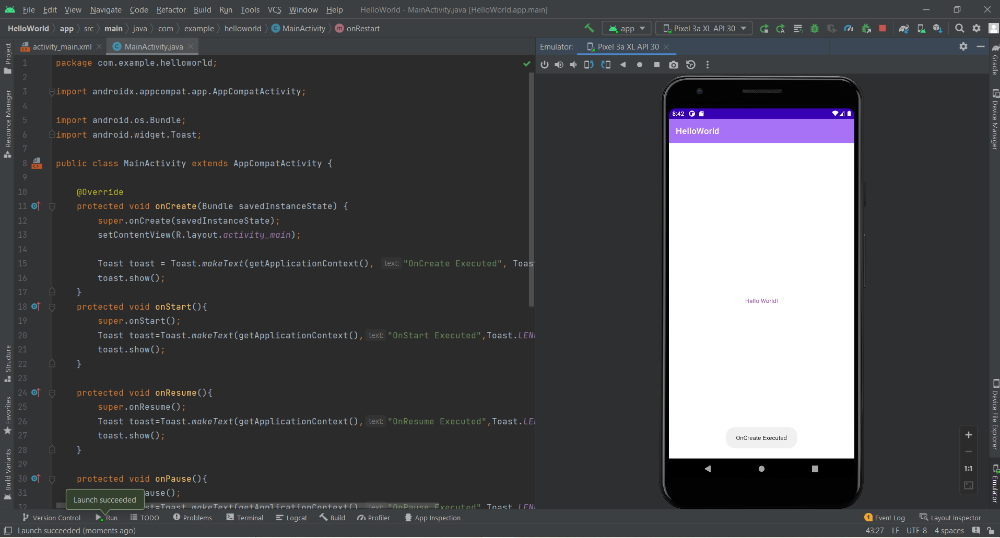
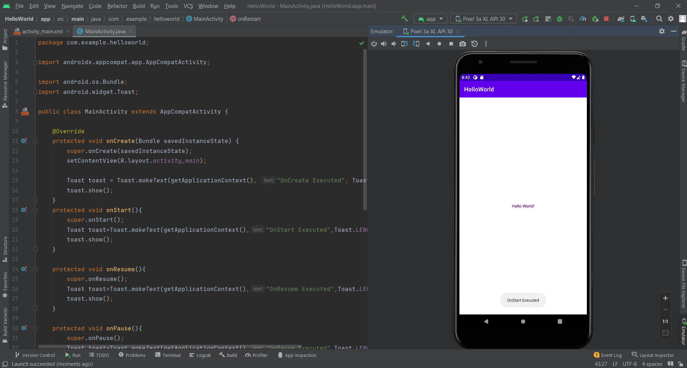
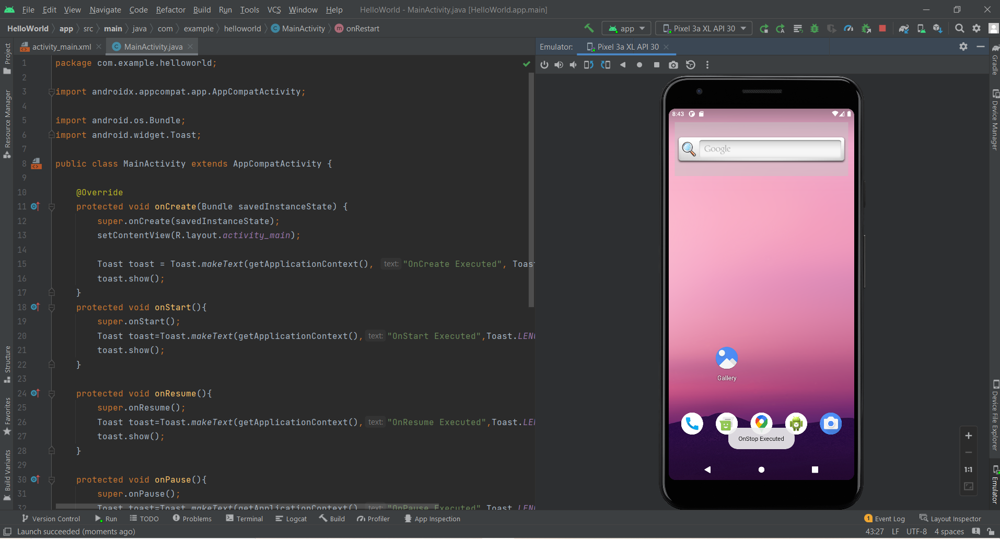
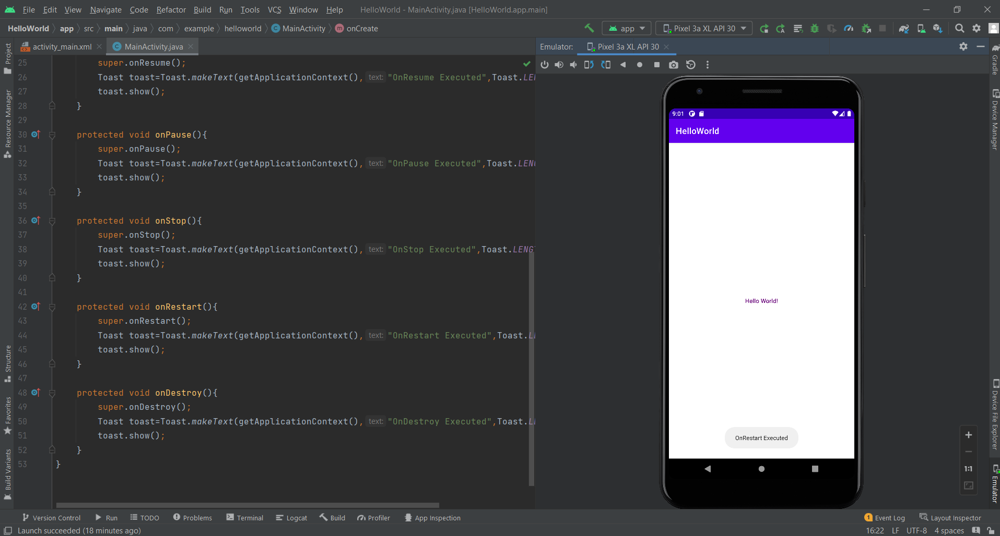

# Ex.No:1 To create a HelloWorld Activity using all lifecycles methods to display messages.


## AIM:

To create a HelloWorld Activity using all lifecycles methods to display messages using Android Studio.

## EQUIPMENTS REQUIRED:

Android Studio(Min.required Artic Fox)

## ALGORITHM:

Step 1: Open Android Stdio and then click on File -> New -> New project.

Step 2: Then type the Application name as HelloWorld and click Next. 

Step 3: Then select the Minimum SDK as shown below and click Next.

Step 4: Then select the Empty Activity and click Next. Finally click Finish.

Step 5: Design layout in activity_main.xml.

Step 6: Display message give in MainActivity file.

Step 7: Save and run the application.

## PROGRAM:
```
/*
Program to print the text “Hello World”.
Developed by: Kaushika.A
Registeration Number : 212221230048
*/
```
## activity_main.xml
```xml
<?xml version="1.0" encoding="utf-8"?>
<androidx.constraintlayout.widget.ConstraintLayout xmlns:android="http://schemas.android.com/apk/res/android"
    xmlns:app="http://schemas.android.com/apk/res-auto"
    xmlns:tools="http://schemas.android.com/tools"
    android:layout_width="match_parent"
    android:layout_height="match_parent"
    tools:context=".MainActivity">

    <TextView
        android:layout_width="wrap_content"
        android:layout_height="wrap_content"
        android:fontFamily="sans-serif-medium"
        android:text="Hello World!"
        android:textColor="#6D0B7E"
        android:textColorHighlight="#FFFFFF"
        android:textColorHint="#FFFFFF"
        app:layout_constraintBottom_toBottomOf="parent"
        app:layout_constraintEnd_toEndOf="parent"
        app:layout_constraintStart_toStartOf="parent"
        app:layout_constraintTop_toTopOf="parent" />

</androidx.constraintlayout.widget.ConstraintLayout>
```
## MainActivity.java
```java
package com.example.helloworld;

import androidx.appcompat.app.AppCompatActivity;

import android.os.Bundle;
import android.widget.Toast;

public class MainActivity extends AppCompatActivity {

    @Override
    protected void onCreate(Bundle savedInstanceState) {
        super.onCreate(savedInstanceState);
        setContentView(R.layout.activity_main);

        Toast toast = Toast.makeText(getApplicationContext(), "OnCreate Executed", Toast.LENGTH_LONG);
        toast.show();
    }
    protected void onStart(){
        super.onStart();
        Toast toast=Toast.makeText(getApplicationContext(),"OnStart Executed",Toast.LENGTH_LONG);
        toast.show();
    }

    protected void onResume(){
        super.onResume();
        Toast toast=Toast.makeText(getApplicationContext(),"OnResume Executed",Toast.LENGTH_LONG);
        toast.show();
    }

    protected void onPause(){
        super.onPause();
        Toast toast=Toast.makeText(getApplicationContext(),"OnPause Executed",Toast.LENGTH_LONG);
        toast.show();
    }

    protected void onStop(){
        super.onStop();
        Toast toast=Toast.makeText(getApplicationContext(),"OnStop Executed",Toast.LENGTH_LONG);
        toast.show();
    }

    protected void onRestart(){
        super.onRestart();
        Toast toast=Toast.makeText(getApplicationContext(),"OnRestart Executed",Toast.LENGTH_LONG);
        toast.show();
    }

    protected void onDestroy(){
        super.onDestroy();
        Toast toast=Toast.makeText(getApplicationContext(),"OnDestroy Executed",Toast.LENGTH_LONG);
        toast.show();
    }
}
```

## OUTPUT










## RESULT
Thus a Simple Android Application create a HelloWorld Activity using all lifecycles methods to display messages using Android Studio is developed and executed successfully.
