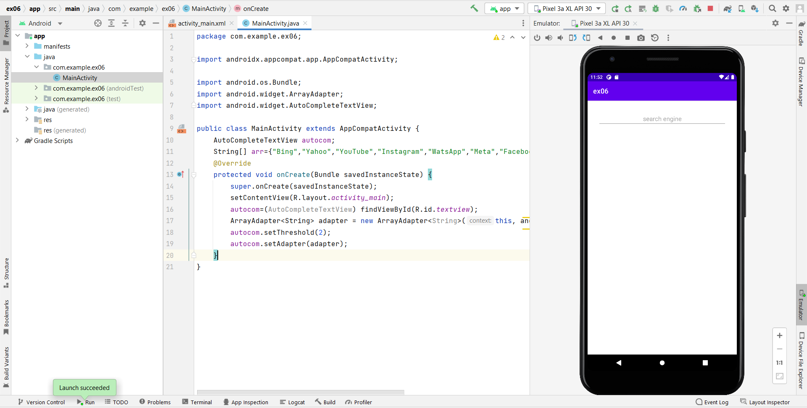
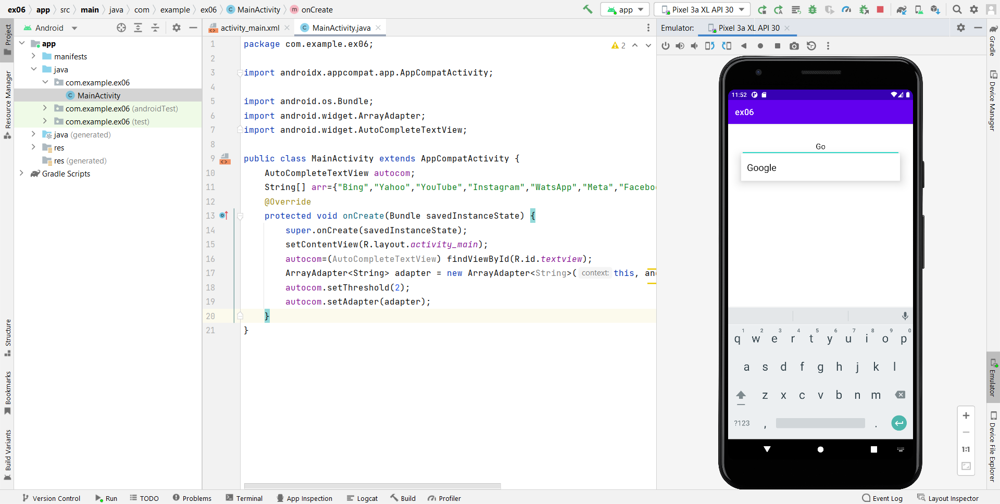
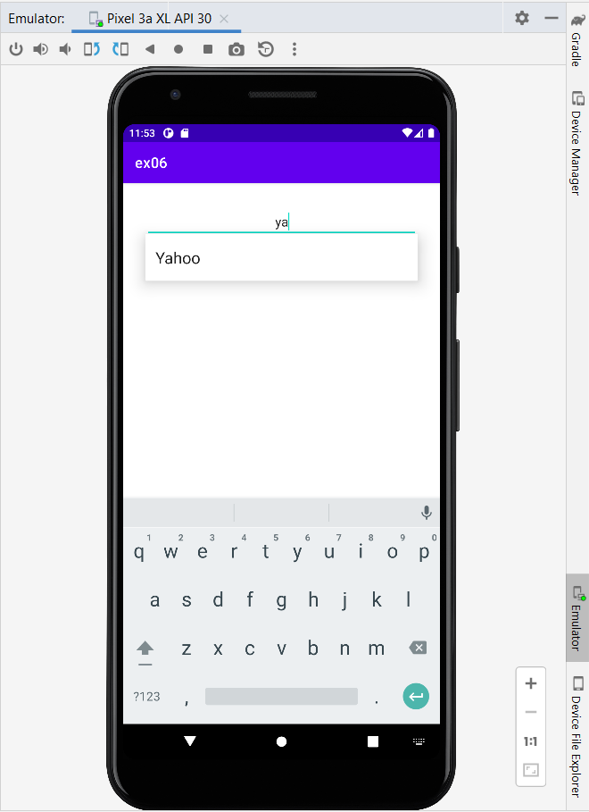
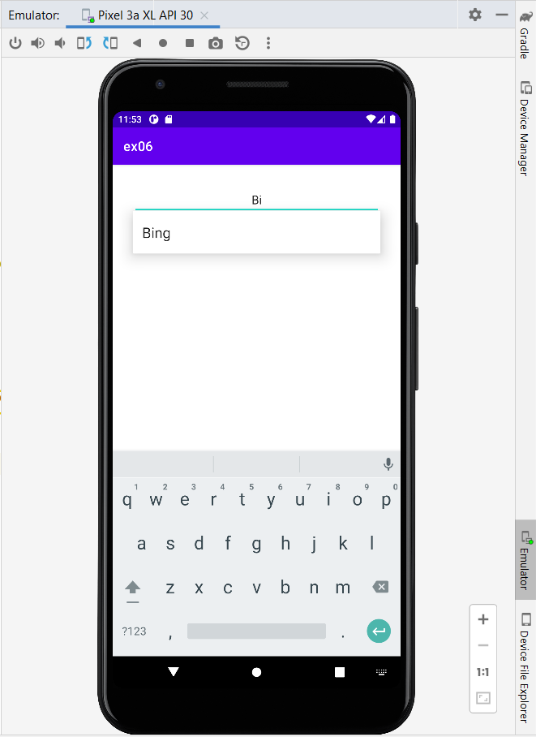

# Ex.No:6 Build a program to create a first display screen of any search engine using Auto Complete Text View.

## AIM:

To develop a program to create a first display screen of any search engine using AutoComplete TextView in Android Studio.

## EQUIPMENTS REQUIRED:

Android Studio(Min.required Artic Fox)

## ALGORITHM:

Step 1: Open Android Stdio and then click on File -> New -> New project.

Step 2: Then type the Application name as searchengine and click Next. 

Step 3: Then select the Minimum SDK as shown below and click Next.

Step 4: Then select the Empty Activity and click Next. Finally click Finish.

Step 5: Design layout using AutoComplete TextView in activity_main.xml.

Step 6: Display screen of search engine in MainActivity file.

Step 7: Save and run the application.

## PROGRAM:
```
/*
Program to print the text “display screen of any search engine”.
Developed by: Kaushika.A
Registeration Number : 212221230048
*/
```
## MainActivity.java:
```java
package com.example.ex06;

import androidx.appcompat.app.AppCompatActivity;

import android.os.Bundle;
import android.widget.ArrayAdapter;
import android.widget.AutoCompleteTextView;

public class MainActivity extends AppCompatActivity {
    AutoCompleteTextView autocom;
    String[] arr={"Bing","Yahoo","YouTube","Instagram","WatsApp","Meta","Facebook","Google","FireFox"};
    @Override
    protected void onCreate(Bundle savedInstanceState) {
        super.onCreate(savedInstanceState);
        setContentView(R.layout.activity_main);
        autocom=(AutoCompleteTextView) findViewById(R.id.textview);
        ArrayAdapter<String> adapter = new ArrayAdapter<String>(this, android.R.layout.select_dialog_item,arr);
        autocom.setThreshold(2);
        autocom.setAdapter(adapter);
    }
}
```

## activity_main.xml:
```xml
<?xml version="1.0" encoding="utf-8"?>
<RelativeLayout xmlns:android="http://schemas.android.com/apk/res/android"
    xmlns:tools="http://schemas.android.com/tools"
    android:layout_width="match_parent"
    android:layout_height="match_parent"
    tools:context=".MainActivity">

    <AutoCompleteTextView
        android:layout_width="match_parent"
        android:layout_height="wrap_content"
        android:id="@+id/textview"
        android:layout_centerHorizontal="true"
        android:layout_marginStart="30dp"
        android:layout_marginTop="30dp"
        android:layout_marginBottom="30dp"
        android:layout_marginEnd="30dp"
        android:ems="10"
        android:hint="search engine"
        android:textAlignment="center"
        tools:ignore="HardcodedText" />
</RelativeLayout>
```
## OUTPUT







## RESULT
Thus a Simple Android Application develop a program to create a first display screen of any search engine using AutoComplete TextView in Android Studio is developed and executed successfully.
